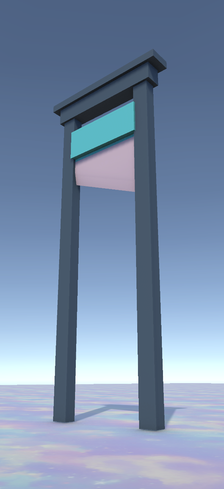

# Hyper-Casual Engel Paketi ve Animasyon Mekanikleri

Bu proje, mobil oyunlar için optimize edilmiş, düşük poligonlu (low-poly) ve animasyonlu bir engel setidir. Süreç; modellerin Blender'da sıfırdan tasarlanmasından başlayıp, Unity içerisinde C# scriptleri ile işlevsel hale getirilmesine kadar tüm aşamaları kapsamaktadır.

---

## 🛠 Kullanılan Teknolojiler

- **Unity 6 (6000.3.2f1)**  
  Projenin geliştirildiği güncel Unity 6 sürümü.

- **C# & DOTween**  
  Engellerin akıcı hareketleri için fizik motoru yerine performans dostu Tween kütüphanesi kullanıldı.

- **Blender**  
  Tüm 3D modeller düşük poligon prensibiyle sıfırdan tasarlandı.

- **NaughtyAttributes**  
  Unity Inspector panelini (Foldout, Button grupları vb.) daha düzenli hale getirmek için entegre edildi.

- **Veri Odaklı Animasyon Sistemi**  
  Her engelin hızı, dönüş açısı ve bekleme süreleri Inspector üzerinden dinamik olarak ayarlanabilir.

---

## ⚙️ Uygulanan Teknik Özellikler

### 1️⃣ 3D Modelleme ve Optimizasyon (Blender)

- **Low-Poly Modelleme**  
  Mobil cihazlarda yüksek performans için optimize edilmiş teknikler kullanıldı.

- **Pivot Noktası Yönetimi**  
  Unity içerisinde doğru rotasyon ve hareket için pivot noktaları Blender'da hassas bir şekilde ayarlandı.

- **UV Mapping**  
  Materyal ve renk tutarlılığı için temiz UV haritaları oluşturuldu.

---

### 2️⃣ Unity Geliştirme ve Scripting

- **C# Programlama**  
  Dönme, sallanma ve gidip-gelme hareketlerini kontrol eden modüler scriptler yazıldı.

- **Matematiksel Animasyonlar**  
  `Mathf.PingPong`, `Mathf.Sin` ve `Quaternion.Lerp` gibi fonksiyonlar kullanılarak kod tabanlı akıcı hareketler sağlandı.

- **Modüler Prefab Sistemi**  
  Parametrelerin Inspector üzerinden kolayca değiştirilebildiği "sürükle-bırak" bir yapı kuruldu.

---

### 3️⃣ Entegrasyon ve Dosya Yapısı

- **Blender - Unity Pipeline**  
  FBX dosyalarının doğru ölçek ve rotasyonla aktarımı için profesyonel dışa aktarım standartları uygulandı.

- **Varlık Organizasyonu**  
  Proje dosyaları (Models, Prefabs, Scripts, Materials) endüstri standartlarına uygun klasörlendi.

---

## 🧱 Uygulanan Engeller

Proje, her biri kendi animasyon mantığına sahip aşağıdaki 3D engel türlerini içerir:

- Dönen Çekiç (Rotating Hammer)  
- Çift Balta (Double Axe)  
- Testere Bıçağı (Saw Blade)  
- Öğütücü (Grinder)  
- Giyotin (Guillotine)  
- Pres Tuzağı (Press Trap)  
- Mızrak Mekanizması (Spear Mechanism)  
- Topuz (Mace)  
- Çift Çubuk (Double Stick)

---

## ▶️ Nasıl Kullanılır?

1. Projeyi Unity 6 ile açın.  
2. `Assets/Prefabs` klasöründeki engellerden birini sahneye sürükleyin.  
3. Objeyi seçtikten sonra üzerindeki script bileşeninden hız, mesafe ve yön gibi ayarları gerçek zamanlı olarak düzenleyin.

---

## 🎥 Görsel Önizleme

---

## 🪓 Giyotin (Guillotine) Engeli  

Low-poly stilinde tasarlanmış, yukarı-aşağı hareket eden animasyonlu bir ölüm engeli.

**Teknik Detaylar:**
- Blender'da modellendi  
- Unity içerisinde C# ile hareket kontrolü sağlandı  
- DOTween kullanılarak akıcı animasyon implementasyonu yapıldı  

