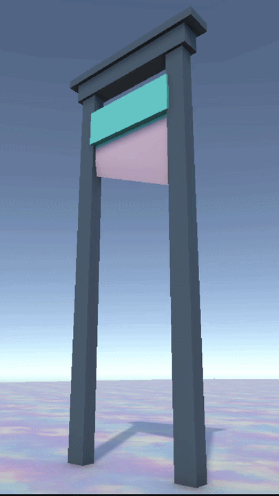
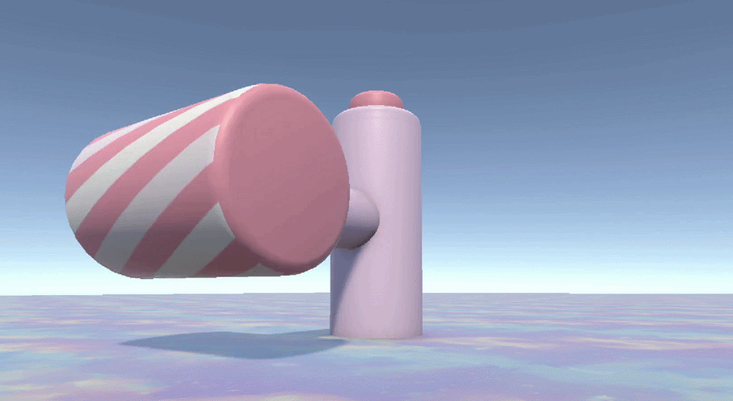

# Hyper-Casual Engel Paketi ve Animasyon Mekanikleri

> Modular low-poly obstacle system developed for hyper-casual mobile games using Unity and C#.

Bu proje, mobil oyunlar için optimize edilmiş düşük poligonlu (low-poly) ve animasyonlu bir 3D engel setidir.

---

## 🛠 Kullanılan Teknolojiler

- **Unity 6 (6000.3.2f1)**  
  Projenin geliştirildiği güncel Unity sürümü.

- **C# & DOTween**  
  Engellerin akıcı hareketleri için fizik motoru yerine performans odaklı Tween tabanlı animasyon sistemi kullanıldı.

- **Blender**  
  Tüm 3D modeller low-poly prensibiyle sıfırdan tasarlandı.

- **NaughtyAttributes**  
  Unity Inspector panelini (Foldout, Button grupları vb.) daha düzenli ve okunabilir hale getirmek için entegre edildi.

- **Veri Odaklı Animasyon Sistemi**  
  Her engelin hız, dönüş açısı ve bekleme süreleri Inspector üzerinden dinamik olarak ayarlanabilir şekilde tasarlandı.

---

## ⚙️ Uygulanan Teknik Özellikler

### 1️⃣ 3D Modelleme ve Optimizasyon (Blender)

- **Low-Poly Modelleme**  
  Mobil cihazlarda yüksek performans için optimize edilmiş modelleme teknikleri kullanıldı.

- **Pivot Noktası Yönetimi**  
  Unity içerisinde doğru rotasyon ve hareket için pivot noktaları Blender’da hassas şekilde ayarlandı.

- **UV Mapping**  
  Materyal ve renk tutarlılığı için temiz UV haritaları oluşturuldu.

---

### 2️⃣ Unity Geliştirme ve Scripting

- **C# Programlama**  
  Dönme, sallanma ve gidip-gelme hareketlerini kontrol eden modüler script mimarisi geliştirildi.

- **Matematiksel Animasyonlar**  
  `Mathf.PingPong`, `Mathf.Sin` ve `Quaternion.Lerp` gibi fonksiyonlar kullanılarak kod tabanlı akıcı hareketler sağlandı.

- **Modüler Prefab Sistemi**  
  Parametrelerin Inspector üzerinden kolayca değiştirilebildiği sürükle-bırak mantığında bir yapı kuruldu.

---

### 3️⃣ Entegrasyon ve Dosya Yapısı

- **Blender → Unity Pipeline**  
  FBX dosyalarının doğru ölçek ve rotasyonla aktarımı için profesyonel dışa aktarım standartları uygulandı.

- **Varlık Organizasyonu**  
  Proje dosyaları (Models, Prefabs, Scripts, Materials) endüstri standartlarına uygun şekilde klasörlendi.

---

## 🧱 Uygulanan Engeller

Bu proje, her biri kendi animasyon mantığına sahip aşağıdaki 3D engel türlerini içerir:

- Dönen Çekiç (Rotating Hammer)  
- Çift Balta (Double Axe)  
- Testere Bıçağı (Saw Blade)  
- Öğütücü (Grinder)  
- Giyotin (Guillotine)  
- Pres Tuzağı (Press Trap)  
- Mızrak Mekanizması (Spear Mechanism)  
- Topuz (Mace)  
- Çift Çubuk (Double Stick)

---

## ▶️ Nasıl Kullanılır?

1. Projeyi Unity 6 ile açın.  
2. `Assets/Prefabs` klasöründeki engellerden birini sahneye sürükleyin.  
3. Objeyi seçtikten sonra ilgili C# bileşeni üzerinden hız, hareket mesafesi, dönüş açısı ve bekleme süresi gibi parametreleri Inspector aracılığıyla gerçek zamanlı olarak düzenleyin.

---

## 🎥 Görsel Önizleme

### 🪓 Giyotin (Guillotine)

Low-poly stilinde tasarlanmış, Inspector üzerinden parametre kontrollü yukarı-aşağı hareket mekanizmasına sahip animasyonlu bir ölüm engeli.

**Teknik Detaylar:**
- Blender’da modellendi  
- Unity içerisinde C# ile hareket kontrolü sağlandı  
- DOTween kullanılarak performans odaklı animasyon sistemi geliştirildi

  
   
  Movement powered by DOTween with a modular C# controller architecture.

---

### 🔨 Dönen Çekiç (Rotating Hammer)

Merkez pivot noktası etrafında sürekli dönüş hareketi yapan, çarpışma bazlı etkileşim için tasarlanmış modüler bir engel sistemi.

**Teknik Detaylar:**
- Blender’da low-poly olarak modellendi  
- C# ile dönüş hızı parametre kontrollü şekilde tasarlandı  
- Sürekli rotasyon için matematiksel hareket mantığı kullanıldı  

  

  <b>Continuous rotation powered by modular C# controller architecture.</b>

---

### 🪚 Testere Bıçağı (Saw)

Ray üzerinde ileri-geri hareket ederken eş zamanlı olarak dönen, çarpışma bazlı etkileşim için tasarlanmış dinamik bir engel sistemi.

**Teknik Detaylar:**
- Blender’da low-poly olarak modellendi  
- Ray boyunca parametre kontrollü lineer hareket sistemi tasarlandı  
- Sürekli rotasyon için matematiksel dönüş mantığı kullanıldı  
- Hareket ve rotasyon senkronize şekilde yapılandırıldı  

  
  

  <b>Synchronized linear translation and continuous rotation via modular C# controller architecture.</b>

---

### ⚙️ Öğütücü (Grinder)

Sabit eksen etrafında yüksek hızda dönen, alan kontrolü ve refleks tabanlı oynanış için tasarlanmış dinamik bir engel sistemi.

**Teknik Detaylar:**
- Blender’da low-poly olarak modellendi  
- C# ile dönüş hızı Inspector üzerinden parametre kontrollü tasarlandı  
- Sürekli rotasyon için matematiksel dönüş mantığı kullanıldı  
- Performans optimizasyonu için fizik yerine transform tabanlı hareket tercih edildi  

  

  <b>High-speed continuous rotation via modular C# controller architecture.</b>

  
